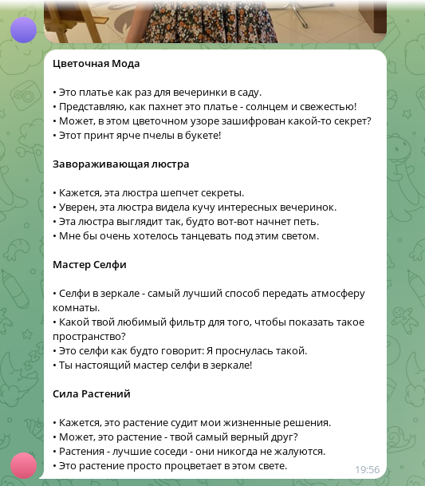

# EasyDate Bot

A simple Telegram bot designed to simplify conversations on dating websites.
The bot can suggest phrases to start a conversation based on a photo from a
profile or how to continue the dialogue.



## Build

Clone repository and start following command:

```sh
mvn package assembly:single
```

## Features

- [x] Generate operers by photo;
- [ ] Generate openers by photo and profile description;
- [ ] Suggest next message for char;
- [ ] Analyze dialog.

## Usage

Start application using following command:

```sh
java -jar target/conversation-0.0.1-SNAPSHOT-jar-with-dependencies.jar \
  --bot-token "TOKEN" \
  --allow-user ID1 \
  --allow-user ID2 \
  --allow-user ID3
```

Where `TOKEN` is telegram bot token. `ID*` owners user id, can be set to -1 bot
will send user id in reply message.

To analyze single image and return openers for it. Use following command:

```sh
java -jar target/conversation-0.0.1-SNAPSHOT-jar-with-dependencies.jar \
  --image IMAGE_PATH
```

## License

Source code is primarily distributed under the terms of the MIT license. See LICENSE for details.
